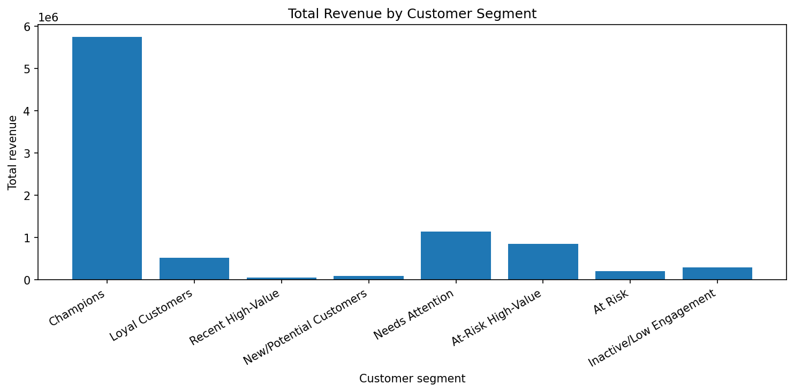
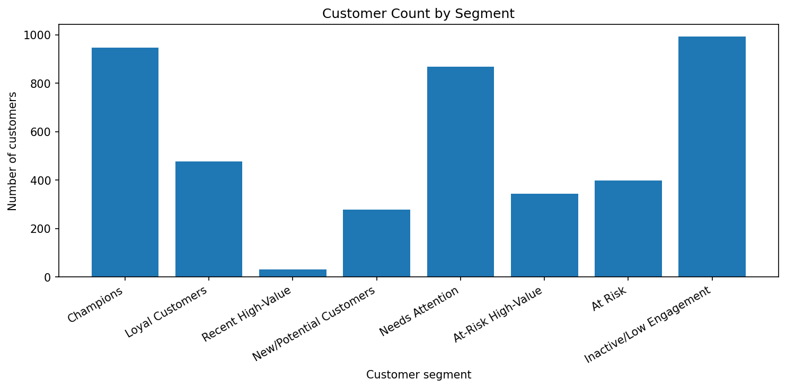
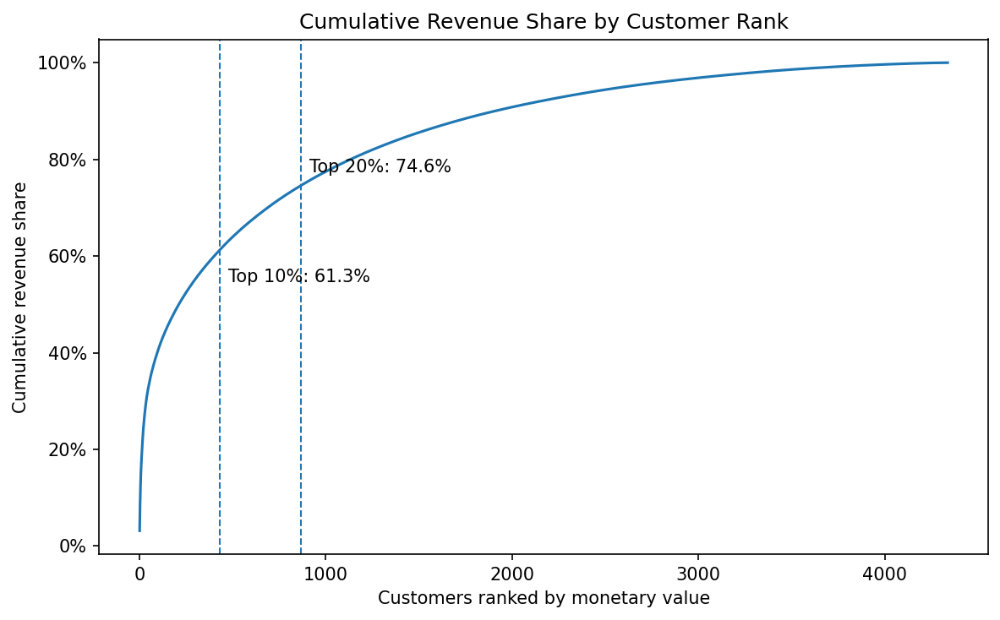
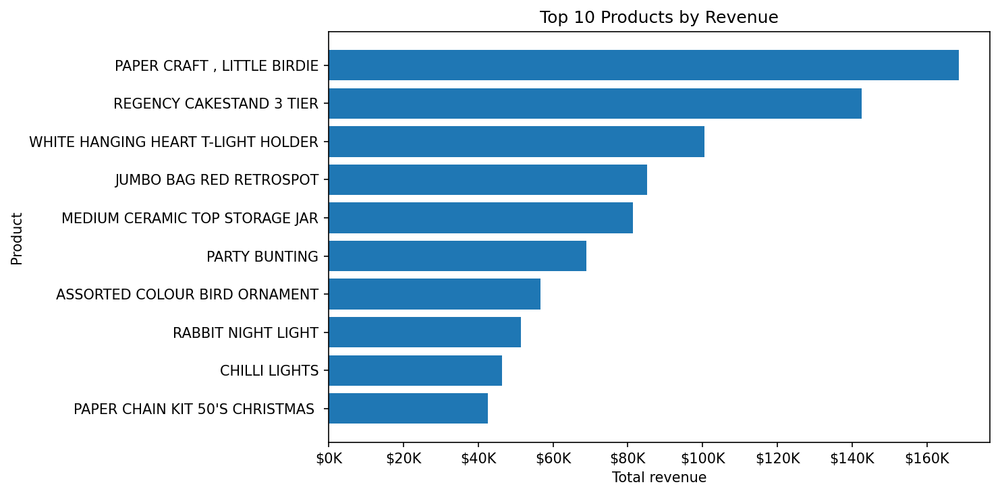
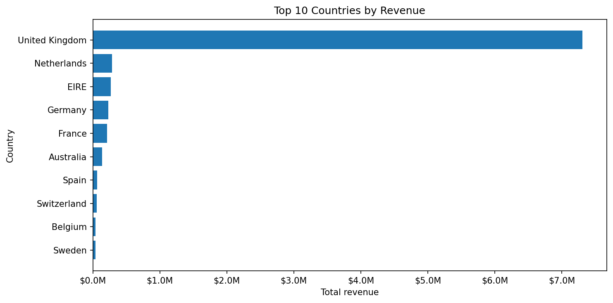
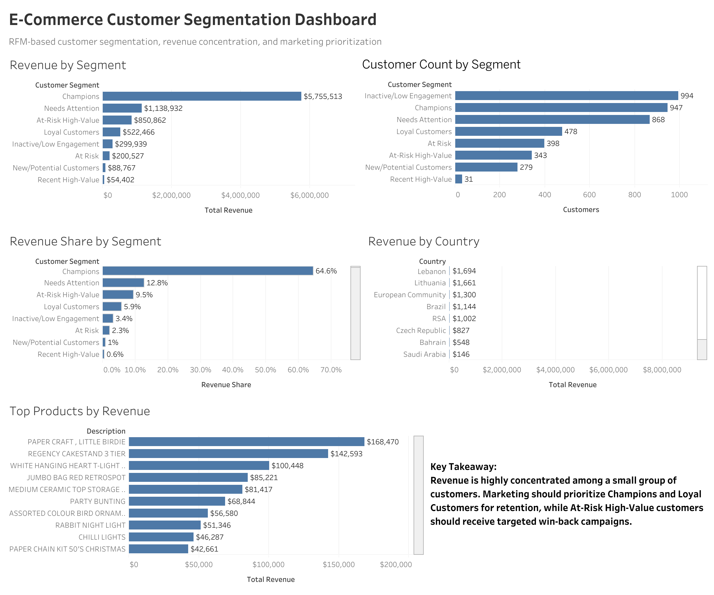

# E-Commerce Customer Segmentation Analysis

## Executive Summary

This project analyzes 397,884 cleaned online retail transactions from 4,338 customers to identify customer segments, revenue concentration, top products, and country-level revenue drivers.

The main finding is that customer revenue is highly concentrated: the top 10% of customers generated 61.3% of total revenue, while the top 20% generated 74.6%. Based on these findings, the analysis recommends prioritizing Champions and Loyal Customers for retention campaigns while targeting At-Risk High-Value customers with win-back campaigns.

## Project Overview

This project analyzes online retail transaction data to identify customer segments, revenue concentration, top products, and country-level revenue drivers. It uses Python for data cleaning, RFM analysis, visualization, and exportable summary tables, then recreates the core analysis workflow in SQL using SQLite.

The goal is to turn raw transaction data into practical business recommendations for customer retention, win-back campaigns, and marketing prioritization.

**Interactive Dashboard:** [View Tableau Dashboard](https://public.tableau.com/app/profile/edward.yoon/viz/ecommercedash_17833880331860/E-CommerceCustomerSegmentationDashboard)

## Business Questions

1. Which customer segments generate the most revenue?
2. Which customers are most valuable to the business?
3. How concentrated is revenue among the top customers?
4. Which products generate the most revenue?
5. Which countries contribute the most revenue?
6. Which customer groups should receive retention or win-back campaigns?

## Tools Used

* Python
* Pandas
* NumPy
* Matplotlib
* Jupyter Notebook
* SQLite
* SQL
* VS Code
* Tableau
* Git / GitHub

## Project Structure

```text
ecommerce-customer-segmentation/
├── README.md
├── requirements.txt
├── .gitignore
├── data/
│   └── online_retail.xlsx              # local only; not committed
├── database/
│   └── ecommerce_segmentation.db       # created locally
├── notebooks/
│   └── ecommerce_customer_segmentation.ipynb
├── outputs/
│   └── tables/
│       ├── clean_transactions.csv
│       ├── cleaning_summary.csv
│       ├── customer_rfm_segments.csv
│       ├── segment_summary.csv
│       ├── top_products.csv
│       ├── country_summary.csv
│       └── customer_revenue_ranked.csv
├── sql/
│   └── customer_segmentation_analysis.sql
├── src/
│   └── load_to_sqlite.py
├── visuals/
│   └── exported chart images
└── report/
    ├── business_summary.md
    └── sql_analysis_output.txt
```

## Analysis Workflow

1. Load and inspect the raw transaction dataset.
2. Clean the data by removing canceled invoices, missing customer IDs, non-positive quantities, invalid prices, and invalid dates.
3. Create a revenue field: `Revenue = Quantity × Unit Price`.
4. Build customer-level RFM metrics: recency, frequency, monetary value, average order value, maximum order value, customer lifetime days, and unique products purchased.
5. Score customers using RFM quintiles.
6. Assign customers to business-friendly segments.
7. Analyze revenue by segment, customer rank, product, and country.
8. Export clean tables for SQL, dashboarding, and reporting.
9. Load the clean transactions into SQLite.
10. Recreate the core analysis using SQL.
11. Export visuals and a business summary report.


## Project Workflow

```text
Raw Excel Data
      ↓
Python Cleaning + Feature Engineering
      ↓
Clean CSV Outputs
      ↓
SQLite Database
      ↓
SQL Analysis
      ↓
Visualizations + Business Recommendations
```

## Customer Segments

* Champions
* Loyal Customers
* Recent High-Value
* New/Potential Customers
* Needs Attention
* At-Risk High-Value
* At Risk
* Inactive/Low Engagement


## Key Findings

* The cleaned dataset contains 397,884 valid transactions and 4,338 unique customers.
* Total cleaned revenue is approximately $8.91M.
* The top 10% of customers generated 61.3% of total revenue.
* The top 20% of customers generated 74.6% of total revenue.
* Champions are the highest-revenue customer segment.
* At-Risk High-Value customers are important targets for win-back campaigns.
* Some top products are broad sellers, while others appear to be bulk-purchase outliers.
* Revenue is heavily concentrated in the United Kingdom.


## Business Impact

This analysis helps an e-commerce business prioritize marketing and retention efforts by identifying which customer groups generate the most revenue.

Key business takeaways:

- High-value customers should receive more targeted retention investment because revenue is concentrated among a small customer group.
- Champions and Loyal Customers are the strongest candidates for loyalty rewards, personalized offers, and early product access.
- At-Risk High-Value customers should be prioritized for win-back campaigns because they have strong historical value but lower recent engagement.
- Broad, equal marketing spend across all customers may be inefficient because the top 10% of customers generated 61.3% of revenue.
- Product outliers should be reviewed before making merchandising or inventory decisions.

## Business Recommendations

1. Prioritize Champions and Loyal Customers with loyalty rewards, early access, and personalized offers.
2. Create win-back campaigns for At-Risk High-Value customers.
3. Encourage second purchases from Recent High-Value and New/Potential Customers.
4. Avoid equal marketing spend across all customer groups because revenue is highly concentrated.
5. Review product outliers before making broad merchandising decisions.
6. Use country-level insights to separate domestic retention strategy from international growth opportunities.

## Data Source

This project uses the Online Retail transaction dataset, which contains invoice-level purchases from a UK-based online retailer. The dataset includes invoice numbers, product descriptions, quantities, invoice dates, unit prices, customer IDs, and countries.

The raw dataset is not included in this repository because of file size and licensing considerations. To reproduce the project, download the dataset separately and place it in:

```text
data/online_retail.xlsx
```

## How to Run This Project

1. Clone the repository.

```bash
git clone <your-repository-url>
cd ecommerce-customer-segmentation
```

2. Install dependencies.

```bash
pip install -r requirements.txt
```

3. Place the raw dataset here:

```text
data/online_retail.xlsx
```

4. Open and run the notebook from top to bottom.

```bash
jupyter notebook notebooks/ecommerce_customer_segmentation.ipynb
```

5. Create the SQLite database after the notebook exports `clean_transactions.csv`.

```bash
python3 src/load_to_sqlite.py
```

6. Run the SQL analysis.

```bash
sqlite3 database/ecommerce_segmentation.db < sql/customer_segmentation_analysis.sql
```

7. Save SQL output to a report file.

```bash
sqlite3 database/ecommerce_segmentation.db < sql/customer_segmentation_analysis.sql > report/sql_analysis_output.txt
```

## Outputs

The notebook creates:

* cleaned transaction data
* customer RFM segment table
* segment summary table
* product revenue table
* country revenue table
* customer revenue ranking table
* visualization PNGs
* a written business summary report

## Key Visualizations

The project exports chart images to the `visuals/` folder. These visuals summarize customer segments, revenue concentration, product performance, and country-level revenue patterns.

### Revenue by Customer Segment


### Customer Count by Segment


### Customer Revenue Concentration


### Top Products by Revenue


### Top Countries by Revenue


## Tableau Dashboard

This project includes an executive Tableau dashboard summarizing customer segments, revenue concentration, top products, and country-level revenue.

[View the Tableau Dashboard](https://public.tableau.com/app/profile/edward.yoon/viz/ecommercedash_17833880331860/E-CommerceCustomerSegmentationDashboard)



## Limitations

* The dataset covers historical transactions from 2010–2011, so the findings do not represent current e-commerce conditions.
* The analysis uses transaction data only; it does not include demographics, acquisition channels, marketing exposure, website behavior, or customer satisfaction.
* RFM segmentation identifies useful customer patterns but does not prove that a specific marketing action will cause retention.
* Product outliers may reflect bulk purchases or unusual transactions and should be reviewed before campaign decisions.

## Skills 

- Data cleaning and validation using Python and pandas
- Feature engineering with RFM customer metrics
- Customer segmentation and revenue concentration analysis
- SQL querying using SQLite, aggregation, filtering, and window functions
- Business analysis and customer retention strategy
- Data visualization and dashboard-ready reporting
- Communication of findings through written business recommendations

